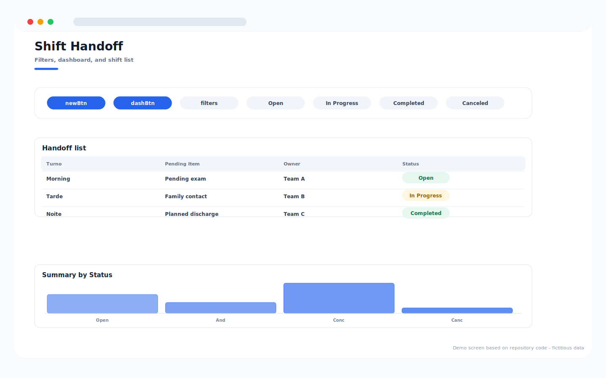
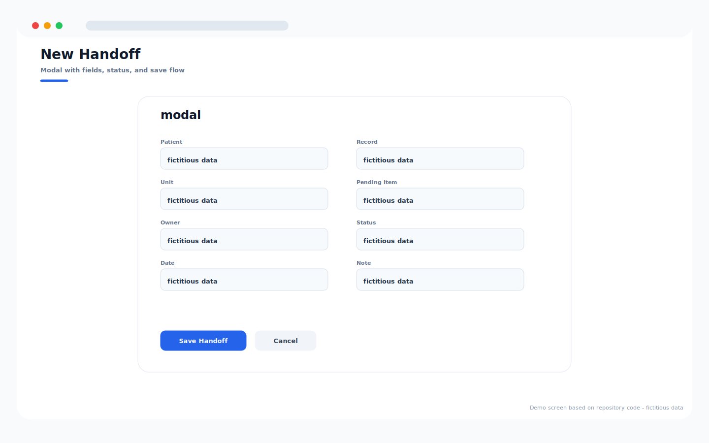
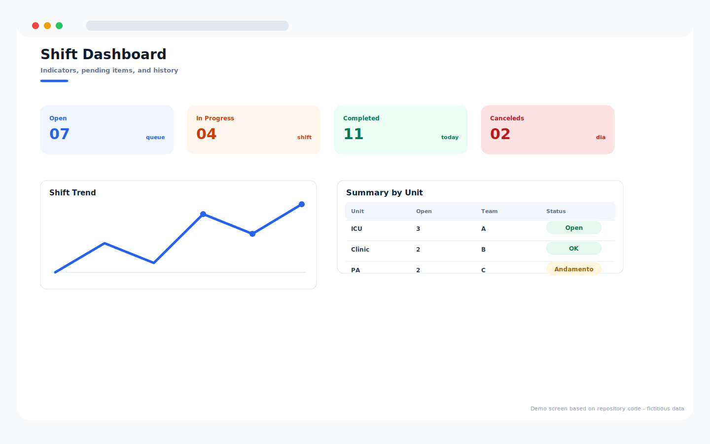

# Shift Handoff System

Repository: `passagem-plantao`

## Overview

Shift handoff app for pending items, status tracking, handoff records, modal entry, dashboard summaries, and history.

## Main Capabilities

- Handoff list with filters and status chips.
- Entry modal for patient, unit, pending item, owner, status, and notes.
- Dashboard by open, in-progress, completed, and canceled handoffs.
- Historical view for shift continuity.

## Operating Flow

1. Open a new handoff item from the list.
2. Fill in unit, owner, pending item, and status.
3. Track the item through the shift dashboard.
4. Close or cancel the handoff when the issue is resolved.

## Visual System Guide

> The screens below are documentation mockups based on the components, labels, colors, and workflows found in this repository. All displayed data is fictitious and does not represent real patients, staff members, or institutions.

### Shift Handoff - list

### Shift Handoff - entry modal

### Shift Handoff - dashboard

## Data Privacy

The repository documentation and guide images use fictitious sample data only.

## Technologies

- JavaScript
- HTML/CSS
- Google Apps Script
- Google Sheets

## Status

Completed
